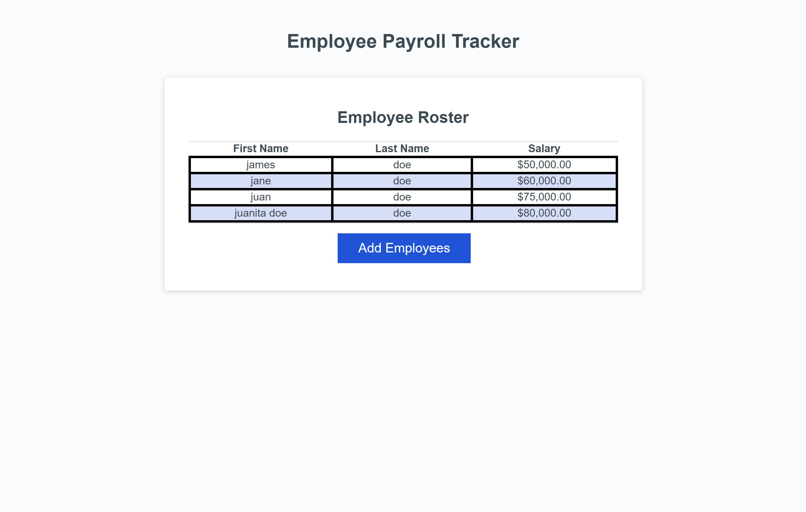

# Employee Payroll Tracker

## Description

The Employee Payroll Tracker is designed to help payroll managers efficiently manage and budget their company's payroll. With this tool, users can easily add employee information, including first names, last names, and salaries. The application ensures that payroll data is organized and accessible, supporting effective budgeting and financial planning.

## Features

- **Add Employee**: Easily add employees to your payroll through a user-friendly interface.
- **Manage Payroll**: View and manage your payroll data to ensure accurate budgeting and financial planning.
- **Data Sorting**: Employee data is automatically sorted alphabetically by last name for easy reference.
- **Aggregated Data**: The console displays computed data such as total payroll expenses, allowing for quick insights and decision-making.

https://rinjeeg.github.io/Employee-Payroll-Tracker/

## Sources

https://github.com/coding-boot-camp/curly-potato
https://chat.openai.com/?model=gpt-4
https://bootcampspot.instructure.com/courses/5271/external_tools/313
https://developer.mozilla.org/en-US/
https://www.w3schools.com/

